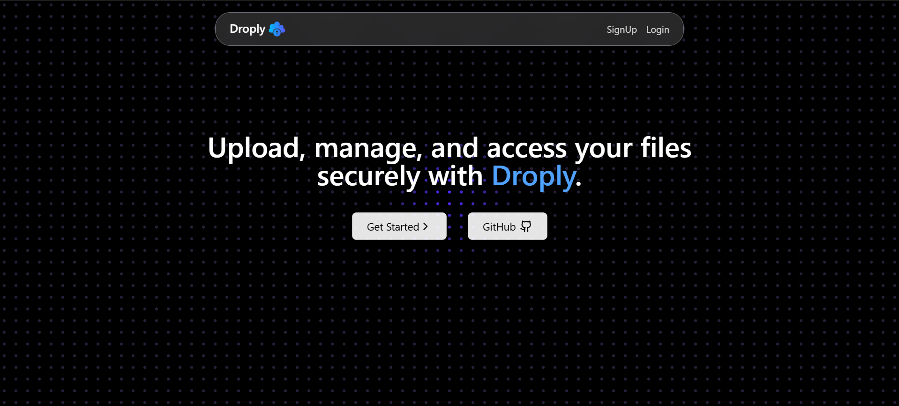
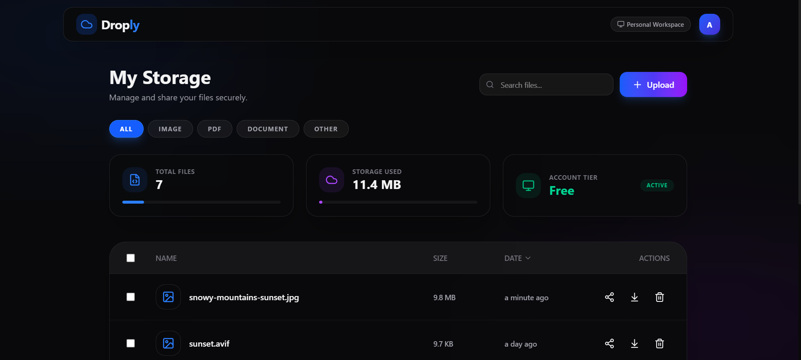

# Droply - File Sharing App

Droply is a modern, secure, and efficient file-sharing application designed to make storing and sharing files seamless. Built with a robust technology stack, it offers a user-friendly interface for managing your files with ease.

## 🌐 Landing Page Preview

Experience the sleek, interactive entry point of Droply. Featuring an advanced particle background system and a modern, immersive design to welcome users.



## 🖥️ Dashboard Overview

The Droply dashboard provides a comprehensive view of your storage at a glance. It features real-time statistics and a clean, glassmorphic file management system.



## 🚀 Key Features

### 📊 Real-time Statistics
- **Total Files**: Instantly see the count of files in your vault.
- **Storage Tracking**: View used vs. available storage in MB with visual progress bars.
- **Account Status**: Monitor your current account tier and health.

### 📤 Seamless File Management
- **Smart Upload**: Support for drag-and-drop and manual file selection with real-time progress.
- **Advanced Filtering**: Quickly group files by type (Images, PDFs, Documents, and more).
- **Instant Search**: Find any file in seconds using the dynamic search bar.
- **Secure Preview**: View file details and previews before downloading or sharing.

### 🔒 Enhanced Security & UX
- **JWT Authentication**: Secure user sessions with protected routes.
- **Public Sharing**: Generate secure, token-based public links for any file.
- **Dark Mode Aesthetic**: A premium, high-contrast dark theme designed for modern workflows.
- **Responsive Layout**: Fully optimized for desktop and mobile devices.
- **Cloud Powered**: Leveraging **ImageKit** for reliable, high-speed file storage and delivery.

## 📁 File Sharing via Public Links

Droply allows users to securely share files using public, token-based share links, similar to modern cloud storage platforms.

### ✨ How it works
- **Share Link Generation**: Generate a unique, shareable link for any file instantly.
- **Token Validation**: Each link uses a secure, database-verified token.
- **Direct Access**: Shared files can be accessed via a clean public interface without requiring login.
- **Secure Redirection**: The backend validates the token and provides a temporary, secure access path.

### 🔐 Why token-based sharing?
- **Privacy**: Prevents exposing internal cloud storage URLs to the public.
- **Control**: Enables link revocation, expiration, and access tracking.
- **Logic**: Keeps all ownership and access business logic server-controlled.


## ⚠️ Limitation
- **Storage Limit**: Due to cloud storage plan limits, uploads are currently restricted to **10MB** per file. 
- **Scalability**: This architecture is ready to scale by upgrading storage providers or plans.

## 🛠️ Technology Stack

### Frontend Core
- **React.js & Vite**: Modern reactive UI with lightning-fast builds.
- **Tailwind CSS**: Contemporary utility-first styling for a custom aesthetic.
- **Lucide React**: Crisp, modern icon set.
- **GSAP & Three.js**: Implemented for advanced animations and visual effects.

### Backend & Storage
- **Node.js & Express**: High-performance backend runtime and framework.
- **MongoDB & Mongoose**: Flexible document storage for metadata.
- **ImageKit**: Distributed cloud storage for global file delivery.
- **JWT & Bcrypt**: Industry-standard security for auth and sensitive data.

## ⚙️ Installation & Setup

Follow these steps to run the project locally.

### Prerequisites
- Node.js installed
- MongoDB installed or a MongoDB Atlas URI
- ImageKit account for file storage credentials

### 1. Clone the Repository
```bash
git clone <repository-url>
cd File_Sharing_App
```

### 2. Backend Setup
Navigate to the backend directory and install dependencies:
```bash
cd backend
npm install
```

Create a `.env` file in the `backend` directory with the following variables:
```env
PORT=3000
MONGODB_URI=your_mongodb_connection_string
CORS_ORIGIN=http://localhost:5173
JWT_SECRET=your_jwt_secret
IMAGEKIT_PUBLIC_KEY=your_imagekit_public_key
IMAGEKIT_PRIVATE_KEY=your_imagekit_private_key
IMAGEKIT_URL_ENDPOINT=your_imagekit_url_endpoint
```

Start the backend server:
```bash
npm start
```

### 3. Frontend Setup
Open a new terminal, navigate to the frontend directory, and install dependencies:
```bash
cd frontend
npm install
```

Start the frontend development server:
```bash
npm run dev
```

The app should now be running at `http://localhost:5173`.

## 👨‍💻 Author

Built by ❤️ **Aditya Kumar**.

- **Portfolio**: [Visit My Portfolio](https://aditya-dev-portfolio-iota.vercel.app/) 
- **GitHub**: [Adityamkumar](https://github.com/Adityamkumar)

---
