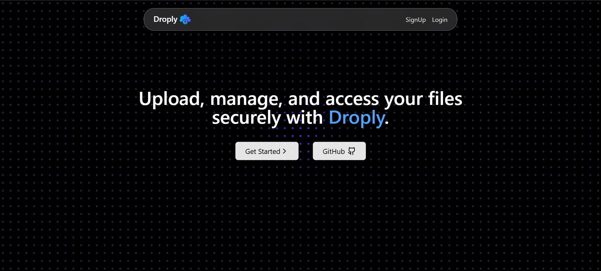
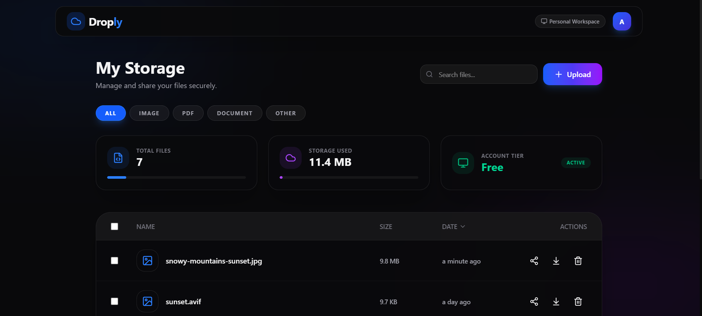

# Droply - File Sharing App

Droply is a modern, secure, and efficient file-sharing application designed to make storing and sharing files seamless. Built with a robust technology stack, it offers a user-friendly interface for managing your files with ease.

## 🌐 Landing Page Preview

Experience the sleek, interactive entry point of Droply. Featuring an advanced particle background system and a modern, immersive design to welcome users.



## 🖥️ Dashboard Overview

The Droply dashboard provides a comprehensive view of your storage at a glance. It features real-time statistics and a clean, glassmorphic file management system.



## 🚀 Key Features

### 📊 Real-time Statistics & Dashboard
- **Total Files**: Instantly see the count of files in your vault with real-time updates.
- **Storage Tracking**: View used vs. available storage in MB with visual progress bars and analytics.
- **Account Status**: Monitor your current account tier, storage health, and file distribution.
- **Interactive Dashboard**: Comprehensive file management interface with advanced controls.

### 📤 Seamless File Management
- **Smart Upload**: Support for drag-and-drop and manual file selection with real-time progress tracking.
- **Advanced Filtering & Sorting**: Quickly group and sort files by type (Images, PDFs, Documents, and more).
- **Batch Operations**: Select multiple files for bulk actions including delete and share operations.
- **Instant Search**: Find any file in seconds using the dynamic search bar with real-time filtering.
- **Secure Preview**: View file details and previews before downloading or sharing.
- **Responsive Controls**: Easy-to-use interface for managing files on desktop and mobile devices.

### 🔒 Enhanced Security & UX
- **JWT Authentication**: Secure user sessions with protected routes and token rotation.
- **Access & Refresh Token Rotation**: Automatic token refresh mechanism for enhanced security with separate expiry times (1 day for access, 7 days for refresh).
- **Secure Logout**: Token invalidation on logout with proper session management.
- **Public Sharing**: Generate secure, token-based public links for any file.
- **Dark Mode Aesthetic**: A premium, high-contrast dark theme designed for modern workflows.
- **Responsive Layout**: Fully optimized for desktop and mobile devices.
- **Cloud Powered**: Leveraging **ImageKit** for reliable, high-speed file storage and delivery.

## 📁 File Sharing via Public Links

Droply allows users to securely share files using public, token-based share links, similar to modern cloud storage platforms.

### ✨ How it works
- **Share Link Generation**: Generate a unique, shareable link for any file instantly.
- **Token Validation**: Each link uses a secure, database-verified token.
- **Direct Access**: Shared files can be accessed via a clean public interface without requiring login.
- **Secure Redirection**: The backend validates the token and provides a temporary, secure access path.

### 🔐 Why token-based sharing?
- **Privacy**: Prevents exposing internal cloud storage URLs to the public.
- **Control**: Enables link revocation, expiration, and access tracking.
- **Logic**: Keeps all ownership and access business logic server-controlled.

## 🔐 Authentication & Authorization System

Droply implements a robust JWT-based authentication system with enhanced security measures:

### ✨ Token Rotation Mechanism
- **Access Token**: Short-lived token (1 day expiry) used for API requests
- **Refresh Token**: Long-lived token (7 days expiry) stored securely in HTTP-only cookies
- **Automatic Rotation**: Access tokens are automatically refreshed without requiring re-login
- **Secure Token Refresh Endpoint**: `/api/auth/refresh-token` validates refresh tokens server-side

### 🛡️ Security Features
- **HTTP-Only Cookies**: Both access and refresh tokens stored as HTTP-only, secure cookies to prevent XSS attacks
- **CORS Protection**: Credentials are only sent to whitelisted origins
- **Secure Flag**: Cookies sent only over HTTPS in production environments
- **SameSite Protection**: CSRF protection with SameSite cookie attributes
- **Bcrypt Password Hashing**: User passwords encrypted with Bcrypt before storage
- **Session Management**: Secure logout invalidates tokens server-side

### 📋 Authentication Endpoints
- `POST /api/auth/user/register` - Register new user
- `POST /api/auth/user/login` - User login with token generation
- `POST /api/auth/refresh-token` - Refresh access token
- `GET /api/auth/user/me` - Get current user info (protected)
- `GET /api/auth/user/logout` - Logout and invalidate tokens (protected)

## 📊 Storage Statistics & Dashboard

### New Storage Insights
- **Real-time Storage Analytics**: View comprehensive storage usage statistics via `/api/stats/storage` endpoint
- **Dashboard Metrics**: 
  - Total files count by user
  - Total storage used (in MB)
  - Available storage remaining
  - Visual progress indicators for storage capacity
- **MongoDB Aggregation**: Efficient server-side aggregation for quick stats generation


## ⚠️ Limitation
- **Storage Limit**: Due to cloud storage plan limits, uploads are currently restricted to **10MB** per file. 
- **Scalability**: This architecture is ready to scale by upgrading storage providers or plans.

## 🛠️ Technology Stack

### Frontend Core
- **React.js & Vite**: Modern reactive UI with lightning-fast builds.
- **Tailwind CSS**: Contemporary utility-first styling for a custom aesthetic.
- **Lucide React**: Crisp, modern icon set.
- **GSAP & Three.js**: Implemented for advanced animations and visual effects.

### Backend & Storage
- **Node.js & Express**: High-performance backend runtime and framework.
- **MongoDB & Mongoose**: Flexible document storage for metadata.
- **ImageKit**: Distributed cloud storage for global file delivery.
- **JWT & Bcrypt**: Industry-standard security for auth and sensitive data.

## ⚙️ Installation & Setup

Follow these steps to run the project locally.

### Prerequisites
- Node.js installed
- MongoDB installed or a MongoDB Atlas URI
- ImageKit account for file storage credentials

### 1. Clone the Repository
```bash
git clone <repository-url>
cd File_Sharing_App
```

### 2. Backend Setup
Navigate to the backend directory and install dependencies:
```bash
cd backend
npm install
```

Create a `.env` file in the `backend` directory with the following variables:
```env
PORT=3000
MONGODB_URI=your_mongodb_connection_string
CORS_ORIGIN=http://localhost:5173
JWT_SECRET=your_jwt_secret
ACCESS_TOKEN_SECRET=your_access_token_secret
REFRESH_TOKEN_SECRET=your_refresh_token_secret
IMAGEKIT_PUBLIC_KEY=your_imagekit_public_key
IMAGEKIT_PRIVATE_KEY=your_imagekit_private_key
IMAGEKIT_URL_ENDPOINT=your_imagekit_url_endpoint
NODE_ENV=development
```

Start the backend server:
```bash
npm start
```

### 3. Frontend Setup
Open a new terminal, navigate to the frontend directory, and install dependencies:
```bash
cd frontend
npm install
```

Start the frontend development server:
```bash
npm run dev
```

The app should now be running at `http://localhost:5173`.

## 👨‍💻 Author

Built by ❤️ **Aditya Kumar**.

- **Portfolio**: [Visit My Portfolio](https://aditya-dev-portfolio-iota.vercel.app/) 
- **GitHub**: [Adityamkumar](https://github.com/Adityamkumar)

---
